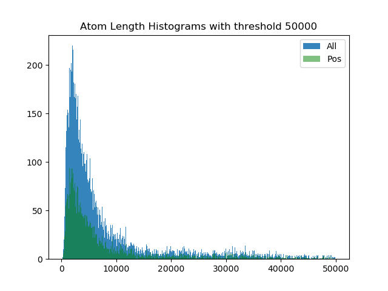
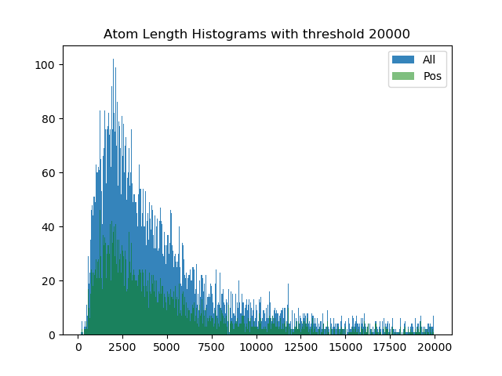

# Dataset Description

11949 proteins: 4662 soluble (42.25%), and 6370 unsoluble (57.74%).

|          | Threshold |  Min | Mean |   Max | Count |  Cut |         Total |
| :------: | :-------: | ---: | ---: | ----: | ----: | ---: | ------------: |
| Postive  |    50k    |  145 | 8118 | 49974 |  4559 |  103 | 4662 (42.25%) |
| Negative |    50k    |  158 | 8129 | 49845 |  6226 |  143 | 6370 (57.74%) |
|   All    |    50k    |  145 | 8124 | 49974 | 10785 |  246 |         11949 |

  
   

## Data integration

**DeepSol Dataset** 

- amino acid sequences and their binary solubility: [[paper]](https://sameerkhurana10.github.io/papers/pre_print.pdf), and [[source]](https://zenodo.org/record/1162886#.XdLx8ZJKhMY)

**Protein Data Bank** (RCSB-PDB): [[file format content v-3.3]](http://www.wwpdb.org/documentation/file-format-content/format33/v3.3.html), and [[Programmatic access]](https://www.rcsb.org/pages/webservices)

**Basic Local Alignment Search Tool** (BLAST): [[Using the Common URL API ]](https://ncbi.github.io/blast-cloud/dev/using-url-api.html)

**UniProt**: [[Access programmatically]](https://www.uniprot.org/help/api)

## Integration Principle

## Tools

Biopython - freely available tools for biological computation
[[doc]](http://biopython.org/DIST/docs/tutorial/Tutorial.html)
[[doc_cn]](https://biopython-cn.readthedocs.io/zh_CN/latest/index.html)

ssbio - python package for structural systems biology
[[doc]](https://ssbio.readthedocs.io/en/latest/)

(optional) PyMOL - a user-sponsored molecular visualization system
[[web]](https://pymol.org/2/)

(optional) Pyecharts - open source visualization tools for Jupyter
[[Github]](https://github.com/pyecharts/pyecharts)
